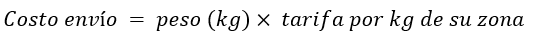
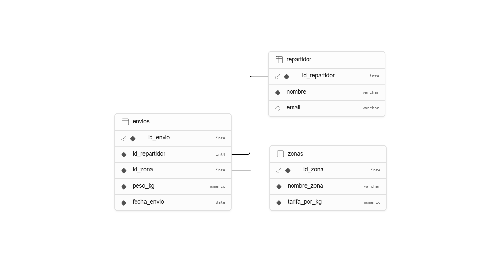

# Mini Core Logística MVC

Aplicación web desarrollada para resolver un problema de logística: calcular el costo total de envíos realizados por cada repartidor dentro de un rango de fechas, aplicando la tarifa por kilogramo definida según la zona de entrega.

El proyecto demuestra la implementación del patrón arquitectónico MVC utilizando un backend con Node.js + Express.js y un frontend desarrollado con Vue 3.

---

# Tecnologías utilizadas

## Backend

- Node.js
- Express.js
- Supabase
- PostgreSQL


## Frontend

- Vue.js 3
- Vite
- Vue Router
- Tailwind CSS


## Infraestructura

- Supabase Cloud (Base de datos)
- Render (Backend)
- Netlify (Frontend)

---

# Arquitectura MVC

El proyecto implementa una separación basada en MVC:

Usuario
|
↓
Vue (View)
|
↓
Express Routes
|
↓
Controller
|
↓
Service
|
↓
Models
|
↓
Supabase PostgreSQL


---

# Estructura del proyecto

```
mini-core-logistica
├─ backend
│  ├─ package-lock.json
│  ├─ package.json
│  ├─ server.js
│  └─ src
│     ├─ app.js
│     ├─ config
│     │  └─ supabase.js
│     ├─ controllers
│     │  └─ envioController.js
│     ├─ models
│     │  ├─ envioModel.js
│     │  ├─ repartidorModel.js
│     │  └─ zonaModel.js
│     ├─ routes
│     │  └─ envioRoutes.js
│     └─ services
│        └─ calculoCostoService.js
├─ frontend
│  ├─ index.html
│  ├─ package-lock.json
│  ├─ package.json
│  ├─ src
│  │  ├─ App.vue
│  │  ├─ components
│  │  │  ├─ TablaDetalle.vue
│  │  │  └─ TablaResumen.vue
│  │  ├─ main.js
│  │  ├─ router
│  │  │  └─ index.js
│  │  ├─ services
│  │  │  └─ envioService.js
│  │  ├─ style.css
│  │  └─ views
│  │     └─ ReporteEnvios.vue
│  └─ vite.config.js
├─ imgs
│  └─ Repartidor.png
└─ README.md

```

---

# Funcionamiento del sistema

**El usuario ingresa:**

- Fecha inicio
- Fecha fin


**El sistema realiza:**

1. Consulta los envíos realizados en el rango seleccionado.
2. Obtiene la zona asociada al envío.
3. Obtiene la tarifa por kilogramo.
4. Calcula:



5. Agrupa los resultados por repartidor.

---

# Modelo de datos

## Tabla Repartidor

| Campo | Descripción |
|-|-|
| id_repartidor | Identificador único |
| nombre | Nombre del repartidor |
| email | Correo |

---

## Tabla Zonas

| Campo | Descripción |
|-|-|
| id_zona | Identificador zona |
| nombre_zona | Zona de entrega |
| tarifa_por_kg | Costo por kilogramo |

---

## Tabla Envios

| Campo | Descripción |
|-|-|
| id_envio | Identificador envío |
| id_repartidor | Repartidor asignado |
| id_zona | Zona entrega |
| peso_kg | Peso paquete |
| fecha_envio | Fecha del envío |

---
## BDD

## Table `repartidor`

### Columns

| Name | Type | Constraints |
|------|------|-------------|
| `id_repartidor` | `int4` | Primary |
| `nombre` | `varchar` |  |
| `email` | `varchar` |  Nullable |

## Table `zonas`

### Columns

| Name | Type | Constraints |
|------|------|-------------|
| `id_zona` | `int4` | Primary |
| `nombre_zona` | `varchar` |  |
| `tarifa_por_kg` | `numeric` |  |

## Table `envios`

### Columns

| Name | Type | Constraints |
|------|------|-------------|
| `id_envio` | `int4` | Primary |
| `id_repartidor` | `int4` |  |
| `id_zona` | `int4` |  |
| `peso_kg` | `numeric` |  |
| `fecha_envio` | `date` |  |

---



---

# Ejemplo de cálculo

**Envío:**

- Peso: 10 kg
- Zona: Norte
- Tarifa: $1.50/kg


**Resultado:**

- 10 × 1.50 = $15.00

---

# Instalación local

## Clonar repositorio

```bash
git clone URL_DEL_REPOSITORIO
```

---

## Backend

**Ingresar al terminal backend:**
- cd backend

**Instalar dependencias:**
- npm install

**Crear archivo:**

- .env

**Dentro:**
- SUPABASE_URL=
- SUPABASE_KEY=

**Ejecutar:**
- npm run dev

**Backend disponible:**
- http://localhost:3000

---

## Frontend

**Ingresar al terminal frontend:**
- cd frontend

**Instalar dependencias:**
- npm install

**Crear archivo:**
- .env

**Dentro:** 
- VITE_API_URL=

**Ejecutar:**
- npm run dev

**Backend disponible:**
- http://localhost:5173

---

# Endpoints principales

**Obtener reporte por fechas:**
- Obtener reporte por fechas

**Parámetros:**
- fechaInicio
- fechaFin

**Ejemplo:**
/api/envios/reporte?fechaInicio=2025-05-01&fechaFin=2025-05-31

---

# Deploys

## Frontend

**Netlify:**
- https://6a384e1d8223adf350e1250f--mini-core-logistica-frontend.netlify.app/

---

## Backend

**Render:**
- https://mini-core-logistica-backend.onrender.com

---

## Base de datos

**Supabase:**
- https://kchaeirkgdecdonwzvpn.supabase.co

---

# Video explicativo

**Video de funcionamiento y explicación MVC:**
- 

---

# Documentación utilizada

**Express.js**
- https://expressjs.com/

**Vue.js**
- https://vuejs.org/

**Supabase**
- https://supabase.com/docs

# Autor

**Nombre:** Rodrigo Andrade

**Correo Institucional:** rodrigo.andrade@udla.edu.ec

